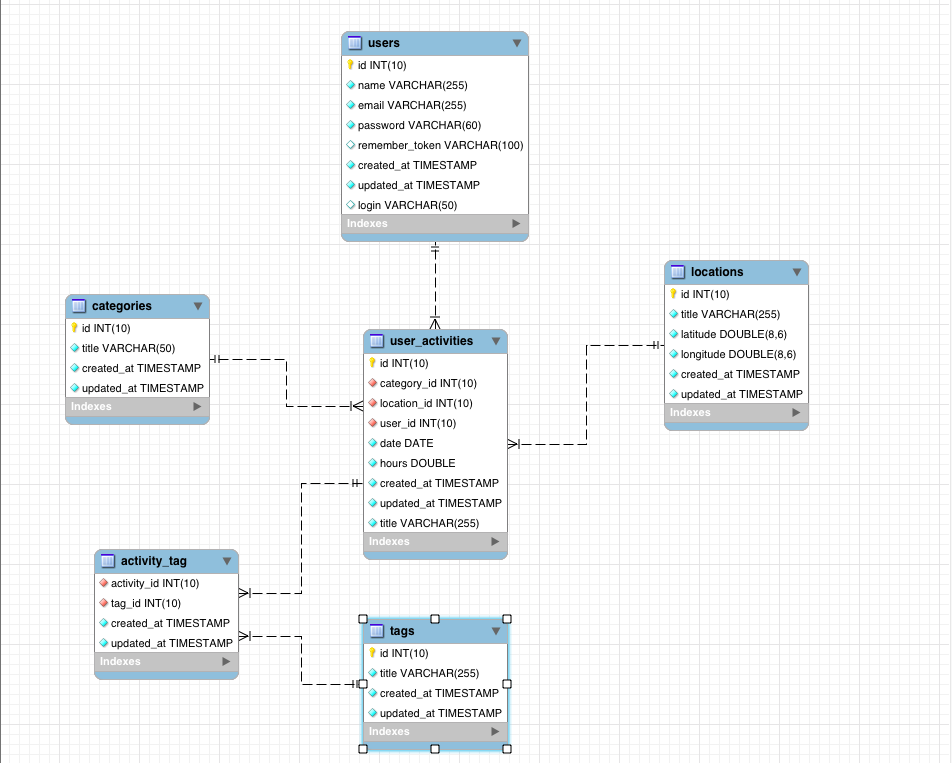

# Университетский проект

## Для чего
Подсчет затреченного времени на дела.

## Технологии
Проект реализован на:
- backend framework - [Laravel 5.1](http://laravel.com/)
- frontend framework - [Angular 1.4](https://angularjs.org/)

### Статус проекта
В [Trello](https://trello.com/b/TiceA2Ja/university-project) вы можете посмотреть, на какой стадии сейчас находится проект

### Вид Базы Данных
